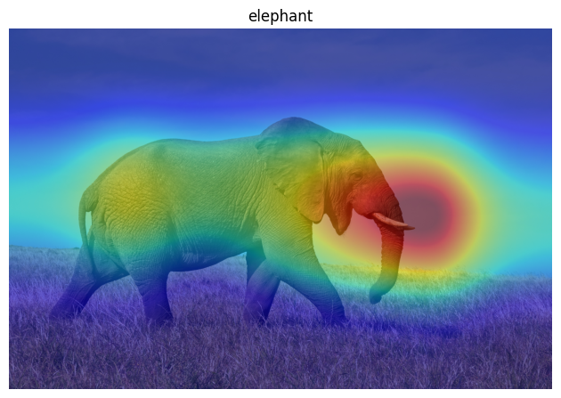
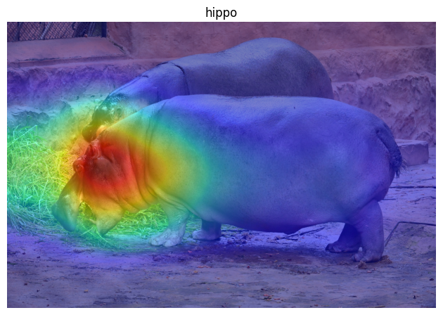
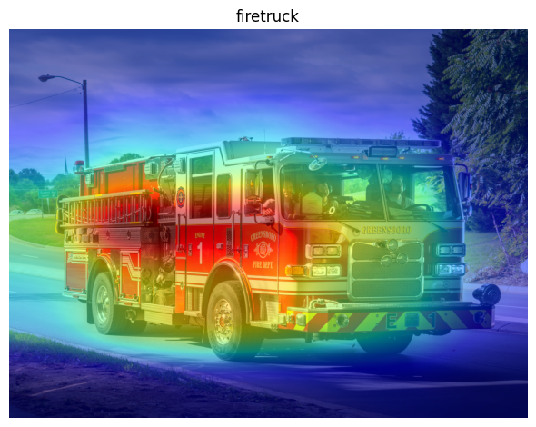
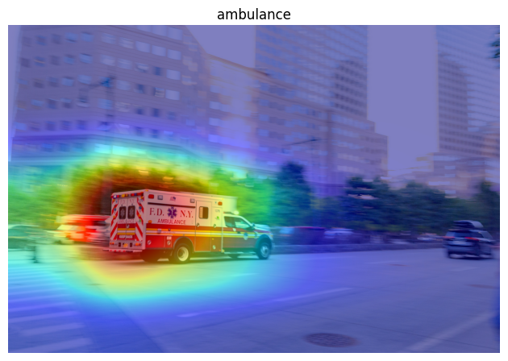
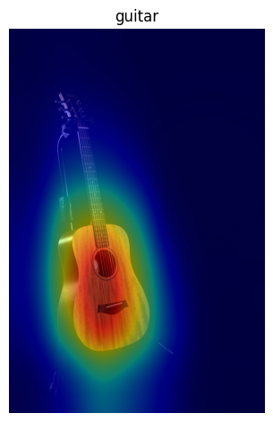
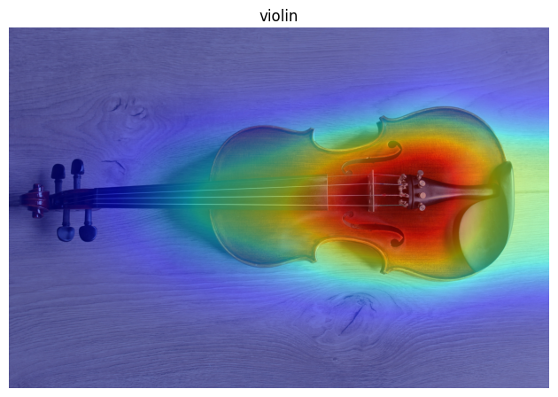
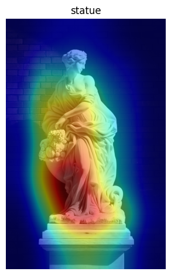
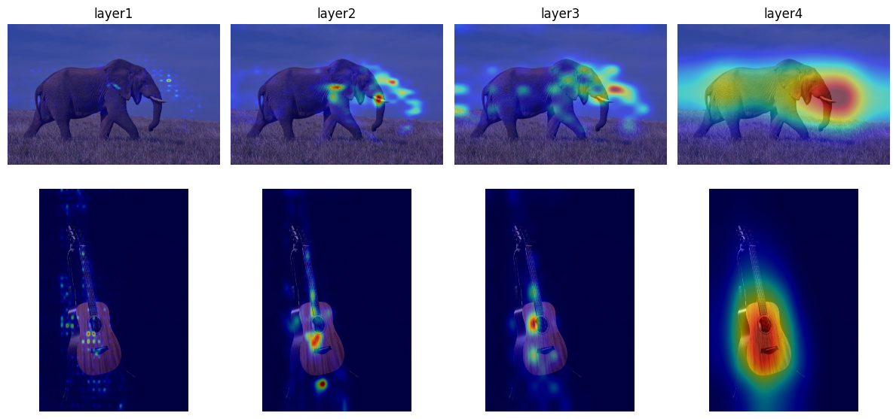

Interpretability of CNN with ImageNet class index

Introduction

This project aims to investigate the interpretability of a Convolutional Neural Network with the help of pretrained CNN model; ResNet18, a Class Atribution Map; torch-cam, and a dataset containing 1000 classes; ImageNet.

Method

For this examination seven images where used.

The first fase of the investigation was to produce a positive and a negative image for three classes. The chosen classes were "African elephant", "Fire engine" and "Acoustic guitar". Three positive images[1][2][3] were porduced. For the Negative images, the correct classification would be "Hippopotamus", "Ambulance" and "Violin".[4][5][6]
These Negatives were chosen for there similar traits to the positives. Aiming to produce the most possible confusion for the model. 
These six images were run though the CAM_extractor with target_layer "layer4" and visualized using matplotlibs imshow().

The produced cams where overlayed ove the original images to give a cleared visualization of the results.

A Predict_class function was created which used the ImageNet Class Index to return a dictionary containing the predicted class index, class id, class name and confidence of prediction.
Each image was run through the function and the resulting predictions printed.

The second fase of the investigation looked at the different layers of the cam. Using two of the positive images, all four target layers' cams were produced and visualized side by side to show the progression of the layers. This fase aimed to investigate the different details the CNN would focus on for the classification.

The third fase of the investigation used an image which class was not included in the ImageNet Class Index. The image was run through the layer4 cam_extractor and predict_class function. This investigation aimed to deduce the reasoning for the CNN's classification of an unknown class.

Results

The ResNet18 model predicted The Images as follows:

Interpretability of CNN with ImageNet class index

Introduction

This project aims to investigate the interpretability of a Convolutional Neural Network with the help of pretrained CNN model; ResNet18, a Class Atribution Map; torch-cam, and a dataset containing 1000 classes; ImageNet.

Method

For this examination seven images where used.

The first fase of the investigation was to produce a positive and a negative image for three classes. The chosen classes were "African elephant", "Fire engine" and "Acoustic guitar". Three positive images[1][2][3] were porduced. For the Negative images, the correct classification would be "Hippopotamus", "Ambulance" and "Violin".[4][5][6]
These Negatives were chosen for there similar traits to the positives. Aiming to produce the most possible confusion for the model. 
These six images were run though the CAM_extractor with target_layer "layer4" and visualized using matplotlibs imshow().

The produced cams where overlayed ove the original images to give a cleared visualization of the results.

A Predict_class function was created which used the ImageNet Class Index to return a dictionary containing the predicted class index, class id, class name and confidence of prediction.
Each image was run through the function and the resulting predictions printed.

The second fase of the investigation looked at the different layers of the cam. Using two of the positive images, all four target layers' cams were produced and visualized side by side to show the progression of the layers. This fase aimed to investigate the different details the CNN would focus on for the classification.

The third fase of the investigation used an image which class was not included in the ImageNet Class Index. The image was run through the layer4 cam_extractor and predict_class function. This investigation aimed to deduce the reasoning for the CNN's classification of an unknown class.

Results

The ResNet18 model predicted The Images as follows:

Image1: {'class_index': '386', 'class_id': 'n02504458', 'class_name': 'African_elephant', 'confidence': 0.5068271160125732}

Image2: {'class_index': '344', 'class_id': 'n02398521', 'class_name': 'hippopotamus', 'confidence': 0.999891996383667}

Image3: {'class_index': '555', 'class_id': 'n03345487', 'class_name': 'fire_engine', 'confidence': 0.9979885816574097}

Image4: {'class_index': '407', 'class_id': 'n02701002', 'class_name': 'ambulance', 'confidence': 0.9393348693847656}

Image5: {'class_index': '402', 'class_id': 'n02676566', 'class_name': 'acoustic_guitar', 'confidence': 0.9951629638671875}

Image6: {'class_index': '889', 'class_id': 'n04536866', 'class_name': 'violin', 'confidence': 0.9552302956581116}

Image7: {'class_index': '708', 'class_id': 'n03903868', 'class_name': 'pedestal', 'confidence': 0.4729427993297577}

