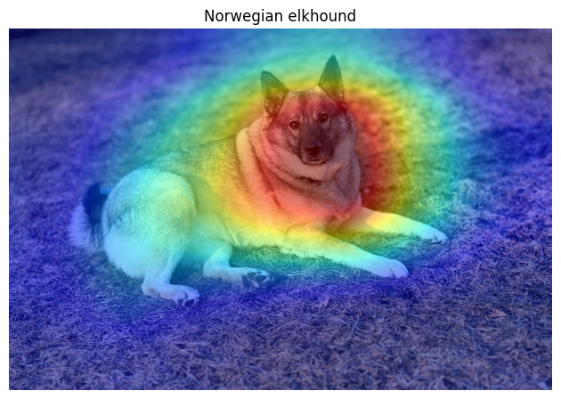
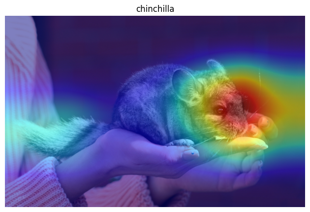
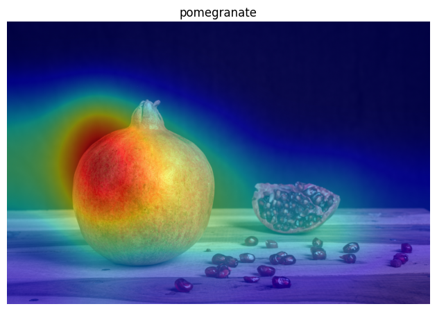
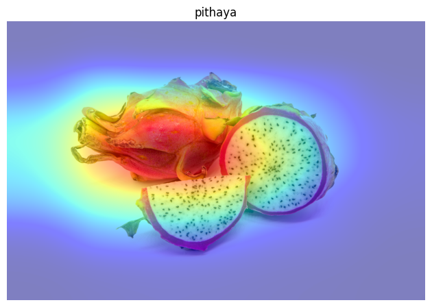
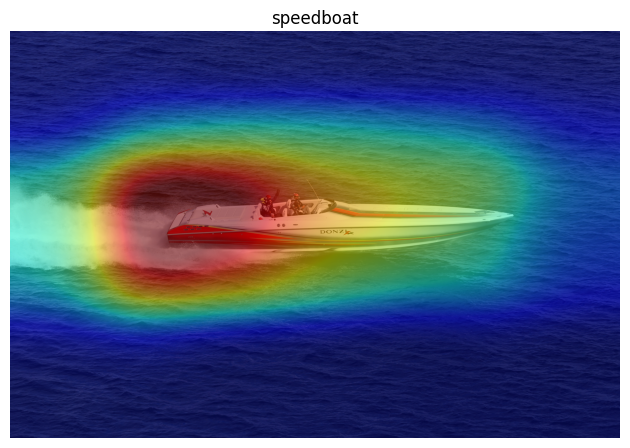
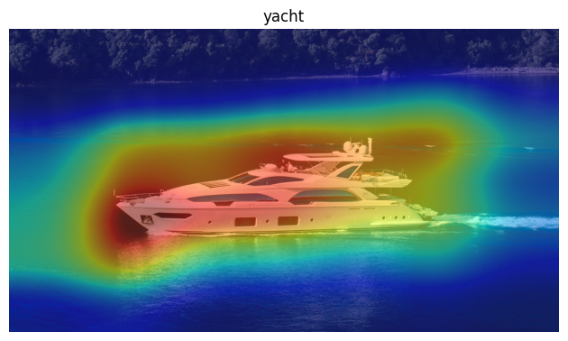
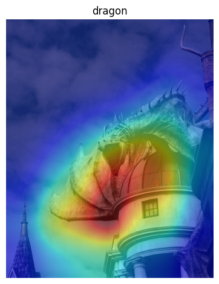
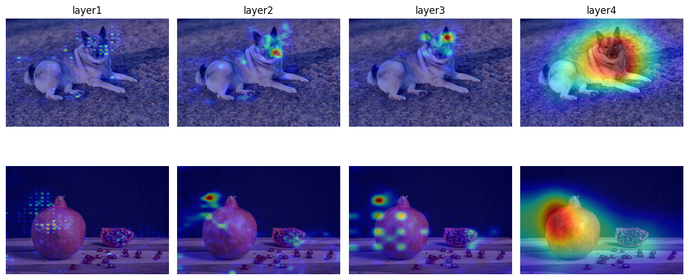

# Interpretability of CNN with ImageNet class index

## Introduction

This project investigates the interpretability of a Convolutional Neural Network using a pretrained CNN model, ResNet18, class activation mapping methods via torchcam and the ImageNet dataset containing 1000 object classes.

## Method

For this examination seven images where used.

The first phase of the investigation was to produce a positive and a negative image for three classes. The chosen classes were "African elephant", "Fire engine" and "Acoustic guitar". Three positive images[1][2][3] were produced. For the Negative images, the correct classification would be "Hippopotamus", "Ambulance" and "Violin".[4][5][6]
These Negatives were chosen for their similar traits to the positives. Incresing the likelihood of model confusion. 
These six images were run through the CAM_extractor with target_layer "layer4" and visualized using matplotlibs imshow().

The produced cams where overlayed over the original images to give a clearer visualization of the results.

A Predict_class function was created which used the ImageNet Class Index to return a dictionary containing the predicted class index, class id, class name and confidence of prediction.
Each image was run through the function and the resulting predictions printed.

The second phase of the investigation looked at the different layers of the cam. Using two of the positive images, all four target layers' cams were produced and visualized side by side to show the progression of the layers. This fase aimed to investigate the different details the CNN would focus on for the classification.

The third phase of the investigation used an image which class was not included in the ImageNet Class Index [7]. The image was run through the layer4 cam_extractor and predict_class function. This investigation aimed to analyze how the model responds to unknown class inputs and to infer the reasoning behind its classification decision.

## Results

The ResNet18 model predicted The Images as follows:

Image1: {'class_index': 174, 'class_id': 'n02091467', 'class_name': 'Norwegian_elkhound', 'confidence': 0.8044467568397522}

Image2: {'class_index': 174, 'class_id': 'n02091467', 'class_name': 'Norwegian_elkhound', 'confidence': 0.7822440266609192}

Image3: {'class_index': 957, 'class_id': 'n07768694', 'class_name': 'pomegranate', 'confidence': 0.9994410872459412}

Image4: {'class_index': 957, 'class_id': 'n07768694', 'class_name': 'pomegranate', 'confidence': 0.133589506149292}

Image5: {'class_index': 814, 'class_id': 'n04273569', 'class_name': 'speedboat', 'confidence': 0.9994126558303833}

Image6: {'class_index': 814, 'class_id': 'n04273569', 'class_name': 'speedboat', 'confidence': 0.6126159429550171}

Image7: {'class_index': 354, 'class_id': 'n02437312', 'class_name': 'Arabian_camel', 'confidence': 0.867834746837616}

The side by side visual of the different layers:

## Discussion

The model held a high confidence level, above 95% for five the initial six images, the exception being the African elephant which was only predicted with a 50.68% confidence. This deviance is presumed to be due to the visual similarity between the African elephant and the Indian elephant, both present in the class index.
The model correctly predicted all the images despite the similar traits in the positives and negatives.
The heatmaps show that for the elephant the identifying traits are the tusks and the trunk.
For the hippo it's the little ears.
For the fire engine it seems to be the side of the truck with a focus on the doors.
for the ambulance the focus is on the back doors and on the text on the side of the vehicle.
For the guitarr the focus is on the wooden body.
And for the violin the identifier seems to be the tailpiece.

Looking at the CAMs of the different layers for the African elephant and the acoustic guitarr we can derrive the focus of the different layers.
The first layer focused on features such as edges and textures. It is rather pixelated. But there is some semblance of the shape of the image objective.
The second layer gave more attention to the patterns and specified parts of the picture.
The third layer starts being less pixelated and more focused on the different parts of the objective.
The fourth layer is even less pixelated and has clearly located a classifying part of the objective.

The final image, not part of the class index, incorrectly predicted to be a pedestal, overlayed with the heatmap shows that the models primary focus was the lower part of the statue. Likely due to its curved shape and stone-like texture, which resembles features commonly associated with pedestal structures. But the heatmap is scattered over the whole picture. Along with the poor confidence level it indicates that the model had a hard time identifying this image. But the prediction is not completely unreasonable as there is a similarity between the statue and a pedestal, particularily in material and base structure.

## Sources

[1] Norwegian elkhound (https://unsplash.com/photos/a-dog-laying-in-the-grass-on-a-sunny-day-fSb9bj7-25k)

[2] Pomegranate (https://unsplash.com/photos/red-round-fruit-on-black-surface-SCMnIJV3DrQ)

[3] Speedboat (https://unsplash.com/photos/white-and-red-boat-on-water-during-daytime-y0Br6D28Lkg)

[4] Chinchilla (https://unsplash.com/photos/person-holding-gray-and-white-rabbit-6vU-kvHdGRI)

[5] Pithaya (https://unsplash.com/photos/a-dragon-fruit-cut-in-half-on-a-white-background-IbRkYrIgrWo)

[6] Yacht (https://unsplash.com/photos/birds-eye-photography-of-yacht-on-body-of-water-XZOO6QHub60)

[7] Dragon (https://unsplash.com/photos/a-dragon-statue-on-top-of-a-building-eFyVtxyQA34)